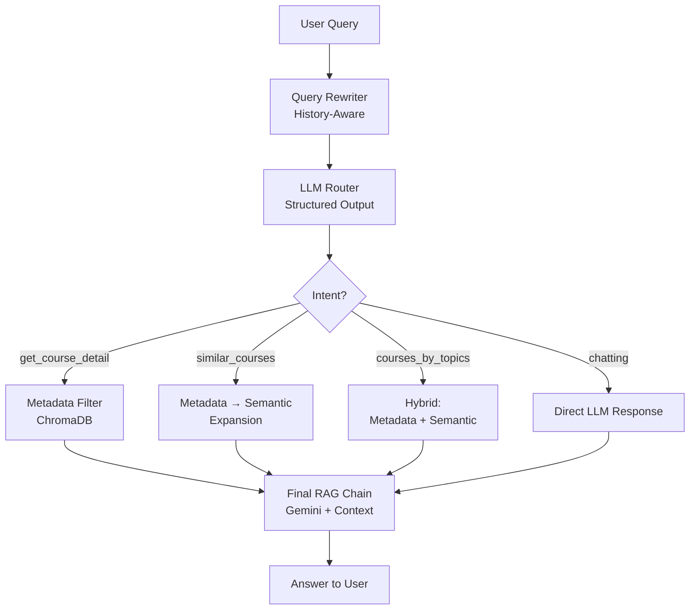

<h1 align="center">
  🎓 Course Buddy AI
</h1>

<p align="center">
  <b>An intelligent, conversational course assistant powered by RAG, LangChain, and Gemini</b><br/>
  <i>Built for IIT Bombay's course catalog — finds courses, recommends alternatives, and understands your campus slang</i>
</p>

<p align="center">
  
  
  
  
  
</p>

---

## 📌 What Is This?

**Course Buddy AI** is a full-stack conversational RAG (Retrieval-Augmented Generation) assistant built to help students navigate the massive IIT Bombay course catalog. It understands natural language, handles follow-up questions, resolves campus department abbreviations (like "comps" → Computer Science and Engineering), and intelligently routes each query through the right retrieval strategy.

This is not a simple keyword search — it's a multi-strategy retrieval pipeline with LLM-powered routing, semantic vector search, fuzzy name matching, and multi-turn conversational memory.

---

## ✨ Key Features & Technical Highlights

### 🧠 1. Multi-Intent LLM Router with Structured Output
The system uses **Google Gemini 2.5 Flash** with `with_structured_output()` and a **Pydantic schema (`CourseMetadataSearch`)** to parse every query into structured intent. Based on the parsed intent, it routes to one of **four distinct retrieval strategies**:

| Intent | Strategy Used |
|---|---|
| `get_course_detail` | Metadata filtering (course code, slot, department) |
| `similar_courses` | Metadata filter → semantic vector expansion |
| `courses_by_topics` | Hybrid: metadata pre-filter + semantic search |
| `chatting` | Direct LLM response, no retrieval |

### 🔍 2. Hybrid Retrieval Pipeline (Metadata + Semantic Search)
Rather than relying purely on vector similarity, the system implements a **two-stage retrieval** approach:
- **Stage 1**: Filter ChromaDB by structured metadata (course code, department, slot) to get a candidate pool
- **Stage 2**: Run a semantic similarity search *within* that candidate pool using the descriptive query

This dramatically improves precision over pure vector search, especially when users combine filters like "ML courses in slot 6."

### 💬 3. Multi-Turn Conversational Memory with History-Aware Query Rewriting
The chatbot maintains a **rolling chat history** and uses a dedicated **query rewriter chain** to transform follow-up questions into standalone queries before retrieval. For example:
> User: "What is CS 772?" → AI: answers → User: "Any similar courses?"
> → Rewritten to: "Are there any courses similar to CS 772?"

This prevents context loss between turns and makes the assistant behave like a real conversation partner.

### 🏷️ 4. Department Lingo Normalization (`handle_department_lingos.py`)
A custom **department alias resolver** maps 30+ department slang terms, abbreviations, and common misspellings to their official IIT Bombay department names. Students can ask for:
- `"comps"` → `computer science and engineering`
- `"mech"` → `mechanical engineering`
- `"cminds"` → `centre for machine intelligence and data science`
- Even `"berozgar"` → `mechanical engineering` 😄

The matched alias is also appended to the query as a context note for better LLM grounding.

### 🔡 5. Fuzzy Instructor Name Matching with RapidFuzz
Instructor lookups use **`rapidfuzz.fuzz.token_sort_ratio`** for fuzzy string matching (threshold: 80%), which correctly matches:
- `"ramesh chandra"` ≈ `"Prof. R. Chandra"`
- Handles partial names, reordered tokens, and abbreviations

### 📦 6. Structured Pydantic Schema with Auto-Normalization
The `CourseMetadataSearch` Pydantic model includes a custom `__init__` that **auto-normalizes inputs** at parse time:
- Course codes: strips spaces, hyphens, lowercases (e.g., `"BB-706"` → `"bb706"`)
- Instructor names: lowercased for consistent matching
- Accepts both comma-separated strings and lists for course codes

### ⛓️ 7. LangChain LCEL Pipeline Architecture
The entire flow is composed using **LangChain Expression Language (LCEL)** with `RunnableSequence`, `RunnableBranch`, `RunnableLambda`, and `RunnablePassthrough` — making the pipeline modular, composable, and easy to extend.

```
User Query
    │
    ▼
[Query Rewriter] ─── history_aware_prompt + Gemini
    │
    ▼
[Router] ─────────── router_prompt + Gemini (structured output)
    │
    ▼
[RunnableBranch] ──── routes to one of 4 retrieval strategies
    │
    ▼
[Final RAG Chain] ─── final_prompt + Gemini + StrOutputParser
    │
    ▼
   Answer
```

### 🗄️ 8. Persistent ChromaDB Vector Store
Course data is embedded using **`sentence-transformers/all-MiniLM-L6-v2`** (via HuggingFace) and stored in a **persisted local ChromaDB collection**. The vector store supports rich metadata filtering using ChromaDB's `$and`, `$in` operators.

---

## 🗂️ Project Structure

```
Course-Buddy-AI/
├── main.py                        # Core RAG pipeline, chains, and chat loop
├── handle_department_lingos.py    # Department alias resolver (30+ departments)
├── requirements.txt               # All Python dependencies
├── courses.json                   # Full IIT Bombay course catalog
├── course_vector_database/        # Persisted ChromaDB embeddings
├── insti_gpt_files/               # Supporting institutional data (grades, rulebook, etc.)
│   ├── grades.json
│   ├── itc.json
│   ├── itc_iitb.txt
│   ├── resobin_courses_final.json
│   └── ugrulebook.json
├── main.ipynb                     # Exploratory notebook with architecture docs
├── mind_map.png                   # Visual architecture mind map
├── .env                           # API keys (not committed)
└── .gitignore
```

---

## 🚀 Getting Started

### Prerequisites
- Python 3.9+
- A [Google AI Studio](https://aistudio.google.com/) API key for Gemini

### 1. Clone the Repository
```bash
git clone https://github.com/AnonymooousUser404/Course-Buddy-AI.git
cd Course-Buddy-AI
```

### 2. Create and Activate a Virtual Environment
```bash
python -m venv course_buddy_venv

# Windows
course_buddy_venv\Scripts\activate

# macOS / Linux
source course_buddy_venv/bin/activate
```

### 3. Install Dependencies
```bash
pip install -r requirements.txt
```

### 4. Set Up Your API Key
Create a `.env` file in the project root:
```env
GOOGLE_API_KEY=your_google_api_key_here
```

### 5. Run the Assistant
```bash
python main.py
```

Type your question at the prompt. Type `exit` to quit.

---

## 💡 Example Queries

```
> Show me CS courses in slot 6
> Any courses similar to CS 772?
> What does Prof. Ramesh Chandra teach?
> Give me ML courses from cminds department
> What is the course content of BB 706?
> Are there any courses on computer vision?
```

---

## 🛠️ Tech Stack

| Technology | Role |
|---|---|
| **Google Gemini 2.5 Flash** | LLM for routing, rewriting, and generation |
| **LangChain (LCEL)** | Pipeline composition and chain orchestration |
| **ChromaDB** | Local persistent vector store |
| **HuggingFace Transformers** | `all-MiniLM-L6-v2` sentence embeddings |
| **RapidFuzz** | Fuzzy string matching for instructor names |
| **Pydantic v1** | Structured output schema with auto-normalization |
| **Python-dotenv** | Secure API key management |

---

## 🧪 Architecture Overview

The system implements a **pre-retrieval routing** pattern — the LLM decides *how* to search *before* actually searching. This avoids the common pitfall of dumping every query into a generic vector search and getting irrelevant results.



---

## 📄 License

This project is open source and available under the [MIT License](LICENSE).

---

<p align="center">
  Made with ❤️ for navigating course catalogs  <br/>
  <i>If you found this useful, drop a ⭐ on the repo!</i>
</p>
